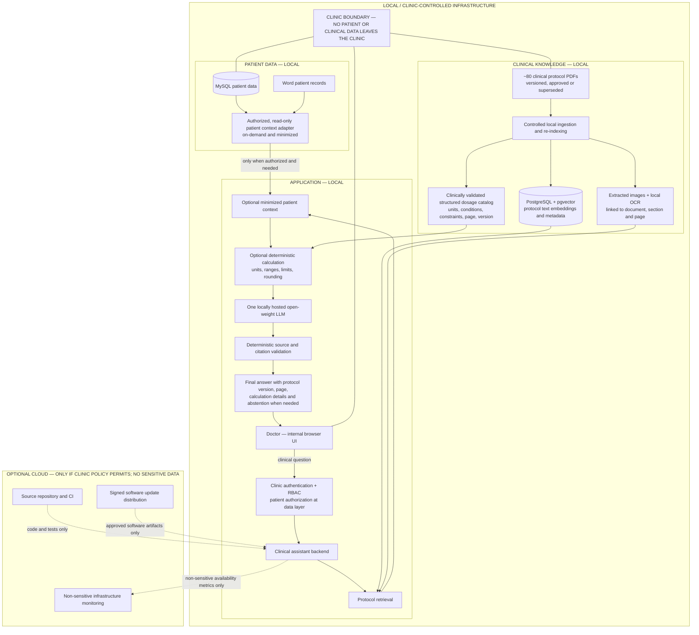

# 1. Executive Summary

The proposal is an internal clinical decision-support assistant for a medium private clinic with approximately 80 healthcare professionals. It will let an authorized doctor ask questions about the clinic's approved clinical protocols, optionally add the minimum necessary patient context, and receive a concise answer with visible protocol version, page, and source citations. Where a question requires dosage or another critical calculation, tested deterministic code—not the language model—will perform the arithmetic.

For the Medical Director, the main value is faster access to the clinic's current guidance without replacing clinical judgment. The assistant can reduce time spent searching across roughly 80 protocol PDFs, dosage tables, images, Word patient records, and selected MySQL data. It will explicitly abstain when evidence is insufficient, show the material used, and keep diagnosis, prescription, and treatment accountability with the clinician.

For the Principal AI Engineer, the design separates three trust domains: shared clinical knowledge, authorized patient context, and deterministic calculations. A single locally hosted open-weight LLM explains retrieved evidence; PostgreSQL with pgvector stores protocol embeddings; a structured catalog handles clinically validated dosage rules; and source validation ensures citations come from retrieved metadata rather than model invention. Patient records are fetched on demand and are not copied into the shared protocol vector index.

All patient and clinical data remains inside clinic-controlled infrastructure: documents, embeddings, database records, prompts, responses, calculations, and LLM inference. This directly addresses the data-residency constraint and supports privacy-by-design and the clinic's GDPR obligations without claiming that technology alone establishes compliance.

The solution is deliberately operationally modest for one IT administrator without Python expertise and a moderate budget. It uses one base LLM rather than separate specialty models, one existing-style relational platform extended with pgvector, and a browser-based internal application. A small Docker Compose deployment is a reasonable option; Kubernetes and multiple autonomous agents would add cost and failure modes without proportional value for this clinic.

# 2. Proposed Architecture

The doctor-question path is explicit: doctor → authorization → protocol retrieval → optional patient context → optional deterministic calculation → local LLM → source/citation validation → final answer. Authorization is enforced before patient access and never delegated to the LLM. Patient context is minimized for the question and kept separate from the shared clinical knowledge index.

**Must remain local:** MySQL and Word patient data, protocol PDFs and extracted images, dosage catalog, embeddings, PostgreSQL/pgvector, prompts and responses containing clinical information, calculations, and all LLM inference.

**May use cloud if clinic policy permits and no sensitive data is included:** source-code repository and CI, signed software update distribution, and infrastructure monitoring limited to non-sensitive health/capacity signals. External LLM APIs are not used for clinical workloads.

Protocols updated every 3–6 months enter a controlled workflow: ingest a candidate version, verify extraction and dosage structures, obtain clinical approval, mark the version approved, and only then make it retrievable. Superseded versions remain auditable but are excluded from normal answers. Citations are built from stored metadata and link back to the original page or image.

# 3. Key Technology Decisions

| Component | Choice | Why for this client |
| --- | --- | --- |
| LLM model (cloud or local?) | One open-weight LLM hosted locally/on-premise. Start with one base model and specialty-specific retrieval instructions rather than separate model weights. | Patient and clinical data cannot leave clinic infrastructure. One model is more affordable and maintainable for one administrator, while specialty behavior can evolve through retrieval and prompts. |
| Vector database | Local PostgreSQL + pgvector, storing protocol chunks, embeddings, source/version/page metadata, and approved/superseded status. Patient records are not copied into it. | Approximately 80 protocols form a small corpus. PostgreSQL is mature and persistent; pgvector avoids operating another specialist database and supports controlled backups and updates. |
| How dosage tables are indexed | Extract clinically relevant dosage rules into a structured, versioned catalog with document, version, page, units, population/conditions, constraints and approval state. Keep explanatory text in the RAG index. | Raw table text embeddings can lose rows, units and conditions. Structured rules enable deterministic checks, but extraction and every change require clinical validation before use. |
| How clinical images inside PDFs are handled | Extract original images and link them to document, section and page. Run local OCR where labels/text matter; index adjacent text and metadata, and show the original image/page when useful. | This preserves provenance and makes diagrams retrievable without sending them externally. A generic multimodal LLM is not treated as a safe diagnostic interpreter of clinical images. |
| Tool for doctor calculations | A local deterministic calculation engine with versioned formulas, typed inputs/units, range and contraindication checks, controlled rounding, and clinician-approved test cases. | The LLM may identify and explain a calculation, but critical arithmetic must be reproducible and tested. Results always show inputs, units, formula/version and required clinician review. |
| User interface | A simple internal browser application integrated with clinic authentication and RBAC. | Doctors need no workstation installation; centralized updates and support reduce operational burden. The interface can show answers, citations, original pages/images and calculation details consistently. |

An optional specialized local ECG pre-assessment component could be integrated later if clinically required, but it would have its own validation, intended-use boundary and workflow. It is not a reason to introduce multiple general-purpose agents or model weights into the initial solution.

# 4. What the System Will NOT Do

### A. It will not autonomously diagnose patients

This is clinical decision support, not an autonomous diagnostic system. It can retrieve approved guidance and summarize relevant patient context, but the clinician remains responsible for diagnosis, interpretation, escalation, and treatment decisions.

### B. It will not prescribe medication or autonomously determine treatment

The assistant may retrieve approved dosage guidance and run clinically validated deterministic calculations. Prescription, contraindication assessment, patient-specific validation, and final treatment authorization remain with the doctor. A calculated value is presented as decision-support evidence, not an order.

### C. It will not send patient or clinical information to external AI APIs

Data residency is a core constraint. Patient records, clinical documents, embeddings, prompts, answers, calculations and LLM inference remain local. Optional cloud services receive only source code, approved software artifacts, or non-sensitive infrastructure signals.

# 5. Project Risks

| Risk | Impact | Mitigation |
| --- | --- | --- |
| A stale or superseded clinical protocol is retrieved | A clinician could receive guidance that no longer reflects the clinic's approved practice. | Store version/date and approved/superseded state; use controlled re-indexing and clinical sign-off; exclude superseded versions by default; display protocol version and page on every answer. |
| The LLM produces an unsupported clinical statement | A fluent but unsupported claim could influence care or reduce trust in the system. | Ground generation in retrieved evidence, validate source IDs deterministically, render citations from metadata, require explicit abstention when evidence is insufficient, and evaluate representative clinical questions before release. |
| A dosage calculation is incorrect | Wrong units, ranges or rounding could create direct patient harm. | Use clinically validated structured dosage rules and deterministic tested code; enforce unit/range/constraint checks; maintain clinician-approved test cases; show calculation inputs and require clinician review. |
| A user accesses patient data without authorization | Sensitive information could be disclosed across roles or patient relationships. | Enforce authentication, RBAC and patient authorization in the data-access layer; use read-only least-privilege database access and audit access. Authorization is never decided by the LLM. |
